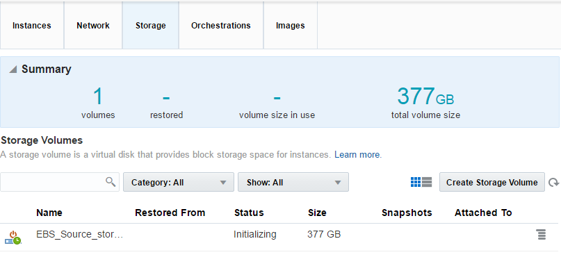
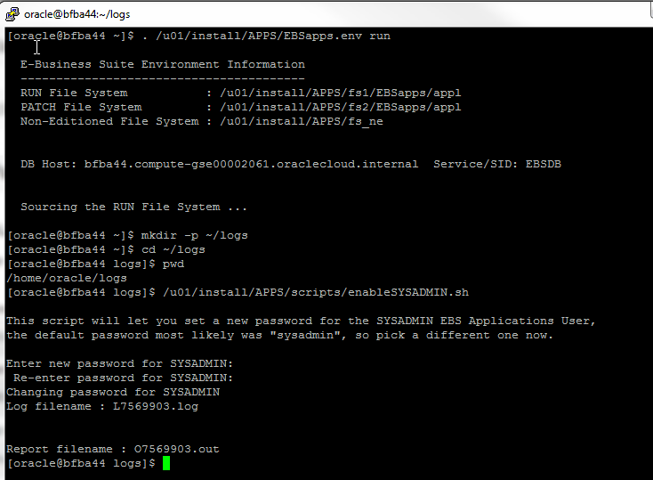
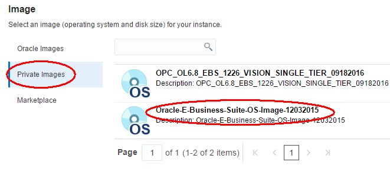
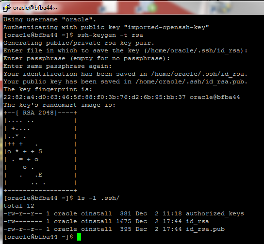
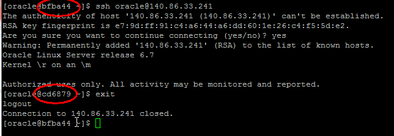
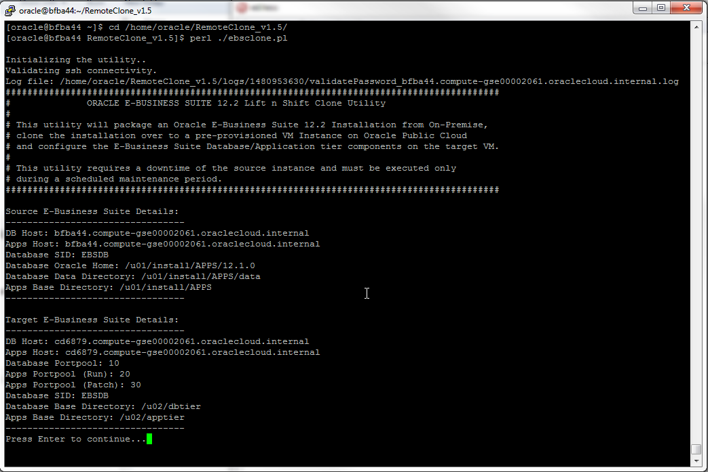

# EBS Lift and Shift to Oracle Public Cloud (OPC) 

Contact: Steven Nichols <steven.nichols@oracle.com>

**Update:** December 5, 2016

## Introduction

This document/lab will walk you through the
steps required to clone an on-premise EBS 12.2.6 environment to the
Oracle Public Cloud (OPC). The application and database tiers are cloned
to the same OPC Compute instance. To reduce the transfer time from
source environment to target environment, the "on-premise", source EBS
instance is also running in an OPC Compute instance.

Please direct comments to: Steven Nichols (<steven.nichols@oracle.com>)

## Outline

- [Introduction](#introduction)
- [Objectives](#objectives)
- [Required Artifacts](#required-artifacts)
- [Prerequisites](#prerequisites)
	- [Install SSH Client Tool](#install-ssh-client-tool)
	- [Install WinSCP](#install-winscp)
	- [Generate Public/Private Key Pair](#generate-publicprivate-key-pair)
	- [Get Apps from Oracle Marketplace](#get-apps-from-oracle-marketplace)
	- [Create Network Security Applications and Rules](#create-network-security-applications-and-rules)
	- [Upload SSH Public Key](#upload-ssh-public-key)
- [Create EBS Source Environment in Compute](#create-ebs-source-environment-in-compute)
	- [Create Source Instance](#create-source-instance)
	- [Log Into Source Instance](#log-into-source-instance)
	- [Copy SSH Key from user opc to user oracle on Source](#copy-ssh-key-from-user-opc-to-user-oracle-on-source)
	- [Create Additional Storage on Source](#create-additional-storage-on-source)
	- [Change Default Passwords for WebLogic and Enable EBS Suite Users](#change-default-passwords-for-weblogic-and-enable-ebs-suite-users)
- [Create EBS Target Environment in Compute](#create-ebs-target-environment-in-compute)
	- [Create Target Instance](#create-target-instance)
	- [Log into Target Instance](#log-into-target-instance)
	- [Configure SSH on Target](#configure-ssh-on-target)
	- [Unlock user oracle on Target](#unlock-user-oracle-on-target)
	- [Copy SSH Key from user opc to user oracle on Target](#copy-ssh-key-from-user-opc-to-user-oracle-on-target)
	- [Format and Mount Disk on Target Image](#format-and-mount-disk-on-target-image)
- [Prepare the Source System for Cloning](#prepare-the-source-system-for-cloning)
	- [Update /etc/hosts file](#update-etchosts-file)
	- [Setup Secure Shell Connection (SSH) between all Application Tiers](#setup-secure-shell-connection-ssh-between-all-application-tiers)
	- [Test SSH Connection between Source and Target for user oracle](#test-ssh-connection-between-source-and-target-for-user-oracle)
	- [Create Stage Directories on Source System](#create-stage-directories-on-source-system)
	- [Verify tar and perl versions](#verify-tar-and-perl-versions)
- [Prepare the Target System for Cloning](#prepare-the-target-system-for-cloning)
	- [Create Stage Directories on Target System](#create-stage-directories-on-target-system)
	- [Verify tar and perl versions](#verify-tar-and-perl-versions-1)
- [Install and Configure EBS Clone Utility](#install-and-configure-ebs-clone-utility)
	- [Download EBS Clone Utility](#download-ebs-clone-utility)
	- [Install the EBS Clone Utility](#install-the-ebs-clone-utility)
	- [Configure EBS Clone Utility](#configure-ebs-clone-utility)
- [Execute EBS Clone Utility](#execute-ebs-clone-utility)
- [Post Clone](#post-clone)
	- [Configure Web Entry Point (optional)](#configure-web-entry-point-optional)
- [Addendum: Using SSH on a Mac or Linux](#addendum-using-ssh-on-a-mac-or-linux)
	- [Using Keygen to Create the Public/Private Keys](#using-keygen-to-create-the-publicprivate-keys)
- [Addendum: EBS Clone Utility Information](#addendum-ebs-clone-utility-information)
	- [Terminal Window Messages](#terminal-window-messages)
	- [Clone Log Directories and Files](#clone-log-directories-and-files)
	- [Stage Directories and Files](#stage-directories-and-files)

## Objectives

-   Create EBS 12.2.6 Vision Demo instance in Oracle Compute Cloud Services
-   Create EBS OS-Only instance in Oracle Compute Cloud Services
-   Clone EBS 12.2.6 instance to EBS OS-Only image

## Required Artifacts

-   The following lab requires an Oracle Public Cloud account that will be supplied by your instructor.
-   EBS 12.2.6 Vision Demo instance running in Compute
-   EBS OS-Only instance in Compute
-   EBS Clone Utility
-   SSH Client (SSH or WinSCP)
	
## Prerequisites

### <a name="install-ssh-client-tool">**STEP 1:** Install SSH Client Tool</a>

-   From any browser, go to the following URL:

	http://www.putty.org/

	

-   Click on the link to download PuTTY. From the PuTTY download page
    click on **putty.exe** to download.

    

-   Save putty.exe. Navigate to the location you downloaded the file and
    double click on **putty.exe** to run.

	

-   We will be using PuTTY later in the workshop to access the newly
    create Cloud Instances. You can minimize or exit PuTTY for now.

### <a name="install-winscp">**STEP 2:** Install WinSCP</a>

-   From any browser, go to the following URL

	https://winscp.net/eng/download.php

    

### <a name="generate-publicprivate-key-pair">**STEP 3:** Generate Public/Private Key Pair</a>

You will need to create an **SSH key** **pair** before you can create
and interact with an Oracle Public Cloud (OPC) environment. SSH keys are
a way to identify trusted computers without involving passwords. You can
generate an SSH key and use the public key during the instance creation.
Later we will show you how to use your private key to access the newly
created Oracle Public Cloud (OPC) environment.

-   To Create the SSH key pair we will be using **PuTTYgen** supplied by
    the instructor.
    
    **Note:** An example showing how to generate an SSH Key using Mac
    OSX (or Linux) is provided in the addendum of this guide. If you are
    using a Mac or Linux, use information from that addendum to
    accomplish what is performed below.

-   Navigate to the location where you installed PuTTYgen and run
    **PUTTYGEN.EXE**. In our example it is located at
    **D:\OPCWorkshop\Putty**

    

-   From the Putty Key Generator application click **Generate**.

    

-   Move mouse around in blank area in order to generate key pair.
    Continue until green bar if full.

    

-   Once pair is generated, select the text within the top box and copy.

    

-   Open **Notepad** and copy text into editor.

    

-   Save the text file with the desired name in the desired directory.

    

-   Once public key is saved, close the text editor and return to
    PuTTYgen and click **Save private key**

    

-   When prompted to continue without a passphrase click **Yes**.

	**Note:** If you want you can enter a passphrase to be used with your private key. This is best practice but for simplicity of the workshop we will not use a passphrase.

	

-   Save the text file with the desired name **xxxxxKey.ppk** in the
    desired directory.

    

-   You may now close out of **PuTTYgen**

### <a name="get-apps-from-oracle-marketplace">**STEP 4:** Get Apps from Oracle Marketplace</a>

-   From any browser, go to the following URL:

	https://cloud.oracle.com/marketplace/

-   Click **Sign In** in the upper right hand corner of the browser:

    

-   Enter your Username and Password and click **Sign In**

    

-   Select the **Applications** tab, click on the **PRODUCTS** drop-down
    and select **INFRASTRUCTURE (IaaS)** -&gt; **Compute Cloud**

    

-   Enter **"e-business"** in the search box and click **Go**

    

-   Click on the **EBS OS-Only Image**.

    

-   Accept **the Oracle Cloud Marketplace Terms of Use** and Click
    **Next**

    

-   If prompted, select the desired **Compute Account** and Click
    **Install**

    

-   The **EBS OS-Only Image** is now associated with your Oracle Public
    Cloud account and available for use within Compute Cloud Services

    

-   Repeat the above steps to associate **Oracle E-Business Suite
    Release 12.2.6 Demo (Vision) Install Image** with your Oracle Public
    Cloud account

    

    

### <a name="create-network-security-applications-and-rules">**STEP 5:** Create Network Security Applications and Rules</a>

The Network Security Applications and Rules allow public access to the
EBS Application tiers through the internet and a web browser. They also
allow access to the underlying instance via SSH. The same access is
shared by both the source and target EBS instance. For the purpose of
this workshop, a large range of ports is opened. This would typically
not be done for security purposes. Lastly, they are created in advance
of the compute instances and are referenced during the instance creation
process.

-   Click on the **Network** tab, **Security Applications** on the left
    side and then **Create Security Application** on the right side

    

-   Enter the name **ebs_http_access** and **5000** and **9999** for
    the port start and end ranges and click **Create**

    

-   Select **Security Rules** on the left hand side and click **Create
    Security Rules**

    

-   Enter the **ebs_http_access** as the name, select
    **ebs_http_access** for the Security Application. Enable
    **Security IP List** for the Source and select **public-internet**.
    For the Destination, enable **Security List** and select **default**
    and click **Create**

    

-   Click **Create Security Rule** again and enter the
    **ebs_ssh_access** as the name, select **ssh** for the Security
    Application. Enable **Security IP List** for the Source and select
    **public-internet**. For the Destination, enable **Security List**
    and select **default** and click **Create**

    

### <a name="upload-ssh-public-key">**STEP 6:** Upload SSH Public Key</a>

The public key created earlier will now be uploaded to OPC. In this
workshop, the same keys are used to access the source and target EBS
instances.

-   Click on the **Network** Tab then click **SSH Pubic Keys**. Click
    **Add SSH Public Key**

    

-   Enter Name **EbsPublicKey**. Open file **xxxxxxx.pub**, created
    earlier, in a text editor. Copy the key and paste into the **Value**
    field. Click **Add**

    

## Create EBS Source Environment in Compute

We will now create the EBS Source instance that will be cloned to
Compute in the Oracle Public Cloud (OPC). For the purposes of this
workshop this Compute instance represents an "on-premise" EBS
environment. The instance is created from the Oracle Cloud Marketplace
image we associated with our OPC account earlier .

### <a name="create-source-instance">**STEP 7:** Create Source Instance</a>

-   From any browser, go to the following URL:

	https://cloud.oracle.com

-   Click **Sign In** in the upper right hand corner of the browser:

    

-   **IMPORTANT** - Under My Services, ask your instructor which **Region** to select from the drop down list, and **click** on the **My Services** button.

    

-   Enter your identity domain and click **Go**

	**NOTE**: the **Identity Domain, User Name** and **Password** values will be given to you from your instructor.

    

-   Once your Identity Domain is set, enter your User Name and Password
    and click **Sign In**

    

-   You will be presented with a Dashboard displaying the various cloud services available to this account.

    

-   If all your services are not visible, **click** on the **Customize
    Dashboard,** you can add services to the dashboard by clicking
    **Show**. If you do not want to see a specific, service click
    **Hide**.

    

-  Open Service Console

-   From the main Cloud Dashboard, click
         within **Compute** to select **Open
    Service Console**

    

-   The **Service Console** page is displayed. Click on **Create
    Instance**

    

-   The Image selection page is displayed. Click on **Private Images**
    if you followed the steps earlier related to the **Oracle Cloud
    Marketplace**. Click **Select** next to the **EBS 12.2.6 Vision
    Single Tier** image. Proceed to the **Shape** by clicking the
    **&gt;** button at the top right.

    

	**Note:** Click on **Marketplace** if you did **NOT** follow the steps earlier related to the **Oracle Cloud Marketplace**. Enter the search string "**EBS 12.2.6**" and click on the **magnifying glass**. Click **Select** for the **EBS 12.2.6 Demo Install Image.** Accept the **Terms of Use** and click **Install**

    

    

-   Select **oc1m** for the **Shape** and click the **&gt;** button at
    the top right

    

-   Enter **EBS_Source** for the **Name** and **Label**

    

-   Click inside Public IP Address and select **Persistent Public IP
    Reservation**

    

-   Click the **Create IP Reservation** button, enter the name
    **EBS_Source_IP** and click **Create**

    

    

-   Click inside of the **Security Lists** field. Select **default**.

    

-   Click inside of the **SSH Keys** field and select **EsbPublicKey.**
    Click on the **&gt;** to proceed.

    

-   Accept the default on the **Storage** page. Click the **&gt;**
    button at the top right

    

-   Review the image setup and click the **Create** button.

    

-   From the **Instances** tab, **Storage** tab or **Orchestration**
    tab, you can monitor the process of the Instance creation.

	**Note**: It may take an hour or more for the instance to appear.

    

    

-   Once the instance is created you are able to view the details. Click
         and select **View**

    

-   On this screen, you can view all the details about the instance that
    is created. For example, the **Public** and **Private** IP address
    along with the **DNS Name**.

    

### <a name="log-into-source-instance">**STEP 8:** Log into Source Instance</a>

We will now access the instance using the **PuTTY** and the instance\'s
**Public IP** address.

-   Get Public IP of Source Instance

-   From the Summary page copy down the **Public IP** for your newly
    created instance. 

    

-   Configure PuTTY to connect to Source Image

-   If you closed out PuTTY start it again.

-   On the **Session** Category paste in the **Public IP** for you
    instance.

    

-   Under category **Connection** click **Data**. Enter **opc** for
    Auto-login username.

    

-   Expand **SSH** and click **Auth**. Click **Browse** and select the
    **xxxxxx.ppk** file that you created earlier in the lab.

    

-   Click back on **Session** category. Enter **EBS_Source_Image** in
    the Saved Sessions and click **Save**. Now click **Open** to connect
    to the instance

    

-   Click **Yes** on PuTTY Security Alert.

    

-   You are now connected to your newly create EBS_Source Image running
    in Compute.

    

### <a name="copy-ssh-key-from-user-opc-to-user-oracle-on-source">**STEP 9:** Copy SSH Key from user opc to user oracle on Source</a>

When the instance is created in Compute, the key is only setup for user
**opc**. Rather than always connecting as **opc** then switching (sudo
su - oracle) to the user **oracle**, you can copy the key to the user
**oracle** and connect via SSH directly as **oracle**.

-   Copy SSH Key from user opc to user oracle on Source

-   Using **PuTTY** and connected using the **opc** user connection you
    just established, run the following commands to copy the SSH key
    from user **opc** to user **oracle**

```
sudo su - root

cp /home/opc/.ssh/authorized_keys /home/oracle/.ssh/authorized_keys

chown oracle:oinstall /home/oracle/.ssh/authorized\_keys
```
-   Repeat the above steps to create another **PuTTY** saved connection
    for the user **oracle**.

### <a name="create-additional-storage-on-source">**STEP 10:** Create Additional Storage on Source</a>

The source EBS instance does not contain enough disk space to support
the EBS Clone utility. The Clone utility requires staging directories to
store the application and database tiers. We will create a new storage
volume, attach it to an existing compute instance and format and mount
the disk.

-   Create Additional Storage to Stage EBS Clone Data

-   From any browser, go to the following URL and log into your OPC
    Account.

	https://cloud.oracle.com

-   Open the Compute **Service Console** and select the **Storage** tab
    and click on **Create Storage Volume**

    

-   Enter the name **EBS_Source_Stage**, **65** for the size and
    select storage property **storage/protocol/iscsi** and click
    **Create**.

    

-   Once the storage is **Online**, click
     to right of the storage disk and
    select **Attach to Instance**.

    

-   Select **EBS_Source** as the instance, accept **2** as the disk #
    and click **Attach**.

    

-   You will see the below attached message.

    

-   Now that the new storage disk is attached, you need to format it and
    mount it. Using the **PuTTY** connection you created earlier, access
    the **EBS_Source** instance run the following commands as the
    **root** user. In this instance, the disk is **/dev/xvdc**.
	
	```
	 sudo su - root

	 fdisk /dev/xvdc

	 Command (mfor help): p
	```

    

-   To create the partition, enter the following commands

	```
	sudo su - root

	fdisk /dev/xvdc

	Command (m for help): n

	Command action

	e extended

	p primary partition (1-4)

	p

	Partition number (1-4): 1

	First cylinder (1-8485, default 1):

	Using default value 1

	Last cylinder, +cylinders or +size{K,M,G} (1-8485, default 8485):

	Using default value 8485

	Command (m for help): w
	```

    

-   To make the file system and mount the disk to directory **/u03**,
    enter the following commands

	```
	mkfs -t ext4 /dev/xvdc1

	mkdir /u03

	mount /dev/xvdc1 /u03

	chown oracle:oinstall /u03
	```

    

-   To make the mount permanent on reboots, edit the **/etc/fstab** file
    and add the following entry

	```
	vi /etc/fstab

	Hit the i key to edit

	/dev/xvdc1 /u03 ext4 defaults 0 0mkdir /u03

	Hit the esc key when finished

	Type :wq to write, then quit the vi editor
	```

    

-   You now see **/dev/xvdc1** available for use

    

### <a name="change-default-passwords-for-weblogic-and-enable-ebs-suite-users">**STEP 11:** Change Default Passwords for WebLogic and Enable EBS Suite Users</a>

You may wish to change the default WebLogic administrator\'s password.
Also, by default, the EBS users in the EBS 12.2.6 Vision Demo instance
are disabled and must be enabled.

-   Change Default Passwords for WebLogic

-   Using a **PuTTY** connection, change the WebLogic Server
    administrator password, enter the following commands as the user
    **oracle**

	```
	sudo su - oracle

	. /u01/install/APPS/EBSapps.env run
	```

    

	**Note:** Make note of the internal host name of the host compute instance. In this example it is **bfba44**. We will use this value in the following commands.

-   Once the user is **oracle** and the EBS environment is set for the
    terminal window, issue the following command to stop the EBS
    application tier except Node Manager and the WebLogic Admin Server

    **Note**: Be sure to replace **&lt;compute\_name&gt;** with the
    internal host name.

	```
	/u01/install/APPS/fs1/inst/apps/EBSDB_<compute_name>/admin/scripts/adstpall.sh -skipNM -skipAdmin

	Enter the APPS username: apps

	Enter the APPS password: apps

	Enter the WebLogic Server password: welcome1
	```

    

    

-   To reset the WLS Admin password, issue the following command

	```
	perl
	/u01/install/APPS/fs1/EBSapps/appl/fnd/12.0.0/patch/115/bin/txkUpdateEBSDomain.pl -action=updateAdminPassword

	Yes

	Accept Default Context File Path

	welcome1

	welcome1

	apps
	```

    

    

-   Once the password is reset, issue the following command to start the
    EBS application tier

    **Note**: Be sure to replace **&lt;compute\_name&gt;** with the
    internal host name.

	```
	/u01/install/APPS/fs1/inst/apps/EBSDB\_&lt;compute\_name&gt;/admin/scripts/adstrtal.sh

	Enter the APPS username: apps

	Enter the APPS password: apps

	Enter the WebLogic Server password: welcome1
	```

    

    

-   Enable EBS Suite Users

-   To enable the user **SYSADMIN** and reset the password, issue the
    following commands

	```
	. /u01/install/APPS/EBSapps.env run

	mkdir -p \~/logs

	cd \~/logs

	/u01/install/APPS/scripts/enableSYSADMIN.sh

	Enter new password for SYSADMIN: welcome1

	Re-enter password for SYSADMIN: welcome1
	```

    

-   To enable the user SYSADMIN and reset the password, issue the
    following commands

	```
	/u01/install/APPS/scripts/enableDEMOusers.sh

	Enter new password for DEMO users: welcome1

	Re-enter password for DEMO users: welcome1
	```

    

-   To verify the passwords were updated successfully, you can view all
    the log entries by issuing the following command

	```
	cat L\*.log | grep FNDCPASS
	```

    

## Create EBS Target Environment in Compute

We will now create the EBS Target instance that will receive the cloned
EBS 12.2.6 environment we just created. The target instance resides
within Compute in the Oracle Public Cloud (OPC). The instance is created
from the Oracle Cloud Marketplace image we associated with our OPC
account earlier

### <a name="create-target-instance">**STEP 12:** Create Target Instance</a>

-   From any browser, go to the following URL and login using your
    Oracle Public Cloud Account.

	https://cloud.oracle.com

-   In the Compute **Service console**, click the **Instances** tab, and
    then click **Create Instance**.

    

-   The **Image** selection page is displayed, either select the
    **Oracle-E-Business-Suite-OS-Image** from within **Private Images**
    or select **EBS OS-Only Image** from the **Oracle Cloud
    Marketplace**. Proceed to the **Shape** by clicking the **&gt;**
    button at the top right.

    

    

-   Select **oc1m** for the **Shape** and click the **&gt;** button at
    the top right

    

-   Enter **EBS_Target** for the **Name** and **Label**

    

-   Click inside Public IP Address and select **Persistent Public IP
    Reservation**

    

-   Click the **Create IP Reservation** button, enter the name
    **EBS_Target_IP** and click **Create**

    

    

-   Click inside of the **Security Lists** field. Select **default**.

    

-   Click inside of the **SSH Keys** field and select **EsbPublicKey.**
    Click on the **&gt;** to proceed.

    

-   On the **Storage** page, click **Add New Volume**

    

-   Enter the name **EBS_Target_Storage_2**, enter **450** for the
    size and select **storage/protocol/iscsi** for the storage property
    then click **Add**

    

-   Click the right arrow **&gt;** to proceed to the **Review** page

    

-   Review the setup and click **Create**

    

-   From the **Instances** tab, **Storage** tab or **Orchestration**
    tab, you can monitor the process of the Instance creation.

	**Note**: It may take 30 minutes for the instance to appear.

-   Once the instance is created you are able to view the details. Click
     and select **View**

    

-   On this screen, you can view all the details about the instance that
    is created. For example, the **Public** and **Private** IP address
    along with the **DNS Name**.

    

### <a name="log-into-target-instance">**STEP 13:** Log into Target Instance</a>

We will now access the instance using the **PuTTY** and the instance\'s
**Public IP** address.

-   Get Public IP of Instance for Target

-   From the Summary page copy down the **Public IP** for your newly
    created instance.

    

-   Configure PuTTY to connect to Target Image

-   If you closed out PuTTY start it again.

-   On the **Session** Category paste in the Public IP for you instance.

    

-   Under category **Connection** click **Data**. Enter **opc** for
    Auto-login username.

    

-   Expand **SSH** and click **Auth**. Click **Browse** and select the
    **xxxxxx.ppk** file that you created earlier in the lab.

    

-   Click back on **Session** category. Enter
    **EBS_Target_Image_opc** in the Saved Sessions and click
    **Save**. Now click **Open** to connect to the instance

    

-   Click **Yes** on PuTTY Security Alert.

    

-   You are now connected to your newly create EBS_Target Image running
    in Compute.

    

### <a name="configure-ssh-on-target">**STEP 14:** Configure SSH on Target</a>

The EBS Clone utility requires a few changes to the SSH configuration on
the target OPC Compute instance. The limits need increased for the below
settings and the user **oracle** needs added as a valid SSH user.

-   Using **PuTTY** and connected using the **opc** user connection you
    just established, run the following commands to configure SSH on the
    target image

	```
	sudo su - root

	cp /etc/ssh/sshd_config /etc/ssh/sshd_config.ORIG

	vi /etc/ssh/sshd_config

	MaxStartups 100

	ClientAliveInterval 100

	ClientAliveCountMax 99999

	AllowUsers opc oracle

	/sbin/service sshd restart
	```

    

### <a name="unlock-user-oracle-on-target">**STEP 15:** Unlock user oracle on Target</a>

On the **EBS OS-Only image** from the Oracle Cloud Marketplace, the user
**oracle** has expired and needs unlocked.

-   Using **PuTTY** and connected using the **opc** user connection you
    just established, run the following commands to view and unlock the
    user **oracle** on the target image

	```
	sudo su - root

	chage -l oracle

	chage -I -1 -m 0 -M 99999 -E -1 oracle

	chage -l oracle
	```

    

### <a name="copy-ssh-key-from-user-opc-to-user-oracle-on-target">**STEP 16:** Copy SSH Key from user opc to user oracle on Target</a>

When the instance is created in Compute, the key is only setup for user
**opc**. Rather than always connecting as **opc** then switching (sudo
su - oracle) to the user **oracle**, you can copy the key to the user
**oracle** and connect via SSH directly as **oracle**.

-   Using **PuTTY** and connected using the **opc** user connection you
    just established, run the following commands to copy the SSH key
    from user **opc** to user **oracle**
	
	```
	sudo su - root

	cp /home/opc/.ssh/authorized\_keys /home/oracle/.ssh/authorized\_keys

	chown oracle:oinstall /home/oracle/.ssh/authorized\_keys
	```

-   Repeat the above steps to create another **PuTTY** saved connection
    for the user **oracle**.

### <a name="format-and-mount-disk-on-target-image">**STEP 17:** Format and Mount Disk on Target Image</a>

The **EBS OS-Only image** from the Oracle Cloud Marketplace only
contains the Linux OS and a few EBS artifacts. When we created the OPC
Compute instance earlier, we also created a 450 GBs storage volume. This
storage volume needs formatted and mounted within the image.

-   Using the **PuTTY** connection you created earlier, access the
    **EBS_Target** instance and run the following commands as the
    **root** user. In this instance, the disk is **/dev/xvdc**.

	```
	sudo su - root

	fdisk -l
	```

    

-   To create the partition, enter the following commands

	```
	sudo su - root

	fdisk /dev/xvdc

	Command (m for help): n

	Command action

	e extended

	p primary partition (1-4)

	p

	Partition number (1-4): 1

	First cylinder (1-58743, default 1):

	Using default value 1

	Last cylinder, +cylinders or +size{K,M,G} (1-58743, default 58743):

	Using default value 58743

	Command (m for help): w
	```

    

-   To make the file system and mount the disk to directory **/u02**,
    enter the following commands

	```
	mkfs -t ext4 /dev/xvdc1

	mkdir /u02

	mount /dev/xvdc1 /u02

	chown oracle:oinstall /u02
	```

    

-   To make the mount permanent on reboots, edit the **/etc/fstab** file
    and add the following entry
	
	```
	vi /etc/fstab

	Hit the i key to edit

	/dev/xvdc1 /u02 ext4 defaults 0 0

	Hit the esc key when finished

	Type :wq to write, then quit the vi editor
	```

    

-   You now see **/dev/xvdc1** available for use

    

## Prepare the Source System for Cloning

### <a name="update-etchosts-file">**STEP 18:** Update /etc/hosts file</a>

SSH communication is required between the source EBS image target EBS
image. The source image requires an entry in the **/etc/hosts** file for
the target image.

-   Using **PuTTY**, connect to the Source EBS image using the user
    **opc** and issue the following commands to an entry to the
    **/etc/hosts file** for the EBS Target image.

    **Note**: Be sure to change the IP address and public and private
    host names to reflect your environment.

	```
	sudu su - root

	vi /etc/hosts

	140.86.33.241 oc-140-86-33-241.compute.oraclecloud.com cd6879.compute-gse00002061.oraclecloud.internal cd6879 oc-140-86-33-241

	cat /etc/hosts
	```

    

### <a name="setup-secure-shell-connection-ssh-between-all-application-tiers">**STEP 19:** Setup Secure Shell Connection (SSH) between all Application Tiers</a>

The SSH communication between the EBS Source and Target application
tiers and images is achieved through the use of trusted computers
without involving passwords. An SSH key pair needs created on the source
image and copied to the target image.

-   Using **PuTTY**, connect to the Source EBS image using the user
    **oracle** and issue the following commands to generate an SSH Key
    pair

    **Note**: More details can be found in the EBS documentation here

    <https://docs.oracle.com/cd/E26401_01/doc.122/e22954.pdf> (chapter
    3, page 76-77)

	```
	ssh-keygen -t rsa

	Enter file in which to save the key (/home/oracle/.ssh/id\_rsa):
	accept default

	Enter passphrase (empty for no passphrase): leave blank

	Enter same passphrase again: leave blank
	```

    

-   Copy the contents of **/home/oracle/.ssh/id\_rsa.pub** on the EBS
    Source system to the **/home/oracle/.ssh/authorized\_keys** on the
    **SAME** EBS Source system. To do this, issue the following commands

	```
	vi /home/oracle/.ssh/authorized\_keys

	Paste contents of **/home/oracle/.ssh/id\_rsa.pub**

	cat /home/oracle/.ssh/authorized\_keys
	```

-   Copy the contents of **/home/oracle/.ssh/id\_rsa.pub** on the EBS
    Source system to the **/home/oracle/.ssh/authorized\_keys** on the
    EBS Target system. To do this, open a second **PuTTY** connection as
    the user **oracle** for the EBS Target system

	```
	vi /home/oracle/.ssh/authorized\_keys

	Paste contents of **/home/oracle/.ssh/id\_rsa.pub**

	cat /home/oracle/.ssh/authorized\_keys
	```

    

### <a name="test-ssh-connection-between-source-and-target-for-user-oracle">**STEP 20:** Test SSH Connection between Source and Target for user oracle</a>

-   Using **PuTTY**, connect to the Source EBS image using the user
    **oracle** and issue the following commands to test **SSH**
    connectivity from source to target for user **oracle **

    **Note**: You are prompted the first time you connect if you wish
    continue, type **Yes** to connect.

	```
	ssh oracle@140.86.33.241

	ssh oracle@oc-140-86-33-241.compute.oraclecloud.com

	ssh oracle@cd6879.compute-gse00002061.oraclecloud.internal

	ssh oracle@cd6879

	ssh oracle@oc-140-86-33-241
	```

    

	**Note**: You will also notice when you successfully connect, the prompt in the terminal window changes to reflect the system you are connected to.

### <a name="create-stage-directories-on-source-system">**STEP 21:** Create Stage Directories on Source System</a>

The EBS Clone utility compresses (tar) the files of the application and
database tiers and stores them in staging directories on both the source
and target instance.

-   Using **PuTTY**, connect to the Source EBS image using the user
    **oracle** and issue the following commands to create the stage
    directories used by the clone utility.

	```
	mkdir /u03/dbstg

	mkdir /u03/appstg
	```

    

### <a name="verify-tar-and-perl-versions">**STEP 22:** Verify tar and perl versions</a>

-   Using **PuTTY**, connect to the Source EBS image using the user
    **oracle** and issue the following commands to verify the versions
    of **tar** and **perl**. The EBS Clone utility requires the
    following versions

	tar (v1.23 or above preferred)

	perl (v5.10.0 or above preferred)

	```	
	tar --version

	perl --version
	```

    

## Prepare the Target System for Cloning

### <a name="create-stage-directories-on-target-system">**STEP 23:** Create Stage Directories on Target System</a>

The EBS Clone utility compresses (tar) the files of the application and
database tiers and stores them in staging directories on both the source
and target instance.

-   Using **PuTTY**, connect to the Target EBS image using the user
    **oracle** and issue the following commands to create the stage
    directories used by the clone utility.

	```
	mkdir /u02/dbstg

	mkdir /u02/appstg
	```

    

### <a name="verify-tar-and-perl-versions-1">**STEP 24:** Verify tar and perl versions</a>

-   Using **PuTTY**, connect to the Target EBS image using the user
    **oracle** and issue the following commands to verify the versions
    of **tar** and **perl**. The EBS Clone utility requires the
    following versions

    tar (v1.23 or above preferred)

    perl (v5.10.0 or above preferred)

	```
	tar --version

	perl --version
	```

    

## Install and Configure EBS Clone Utility

The EBS Clone utility is installed into and executed on the EBS Source image.

### <a name="download-ebs-clone-utility">**STEP 25:** Download EBS Clone Utility</a>

-   From any browser, go to the following URL:

	https://updates.oracle.com/download/22336899.html

	**Note**: Enter your Oracle SSO Credentials

-   On the Patch page, click on **Download**

    

### <a name="install-the-ebs-clone-utility">**STEP 26:** Install the EBS Clone Utility</a>

-   Using SCP or WinSCP to copy the file **p22336899\_R12\_GENERIC.zip**
    to **/home/oracle/** within the EBS Source Image

-   Using **PuTTY**, connect to the Source EBS image using the user
    **oracle** and issue the following commands to extract and install
    the EBS Clone Utility

	```
	cd /home/oracle

	unzip p22336899\_R12\_GENERIC.zip

	cd /home/oracle/RemoteClone\_v1.5

	chmod +x \*.pl

	chmod +x lib/\*.sh
	```

    

    

### <a name="configure-ebs-clone-utility">**STEP 27:** Configure EBS Clone Utility</a>

The EBS Clone Utility leverages a property file named **cln.props**.
This file contains all the details associated with the Source and Target
EBS environments.

-   Using **PuTTY**, connect to the Source EBS image using the user
    **oracle** and issue the following commands to update the
    **cln.props** file

	```
	cd /home/oracle/RemoteClone\_v1.5

	cp cln.props cln.props.ORIG

	vi cln.props
	```

    

	**Note**: Be sure to the internal host names and identity domain(s) reflect your Oracle Public Cloud accounts.

-   Update the following parameters for the Source EBS image

	```
	### Source EBS details

	HOST.SRC.DB=bfba44.compute-gse00002061.oraclecloud.internal

	OS_USER.SRC.DB=oracle

	OS_PASSWORD.SRC.DB=

	STG_DIR.SRC.DB=/u03/dbstg

	HOST.SRC.APPS=bfba44.compute-gse00002061.oraclecloud.internal

	OS_USER.SRC.APPS=oracle

	OS_PASSWORD.SRC.APPS=

	STG_DIR.SRC.APPS=/u03/appstg

	### Source EBS DBTier Context File

	CONTEXT_FILE.DB.SRC=/u01/install/APPS/12.1.0/appsutil/EBSDB_bfba44.xml

	### Source EBS AppsTier(R12.1) or RUN file system AppsTier Context File(R12.2)

	CONTEXT_FILE.APPS.SRC=/u01/install/APPS/fs1/inst/apps/EBSDB_bfba44/appl/admin/EBSDB_bfba44.xml

	### Source Database Apps schema password

	APPS_PASS=apps
	```

-   Update the following parameters for the Target EBS image

	```
	### Target EBS details

	HOST.TGT.DB=cd6879.compute-gse00002061.oraclecloud.internal

	OS_USER.TGT.DB=oracle

	STG_DIR.TGT.DB=/u02/dbstg

	HOST.TGT.APPS=cd6879.compute-gse00002061.oraclecloud.internal

	OS_USER.TGT.APPS=oracle

	STG_DIR.TGT.APPS=/u02/appstg

	### Target EBS Details:

	DB_SID.TGT=EBSDB

	DB_BASE_DIR.TGT=/u02/dbtier

	APPS_BASE_DIR.TGT=/u02/apptier

	APPS_INST_BASE_DIR.TGT=/u02/apptier
	```

-   Update the following WebLogic parameters

	```
	## Properties applicable for EBS R12.2 only

	## Source WLS Admin password

	WLS_ADMIN_PASS=welcome1
	```

-   Be sure the following parameters are commented out

	```
	## STAGE server details

	#HOST.STAGE=xxxx.compute-appsunlimited3.oraclecloud.internal

	#OS_USER.STAGE=oracle

	#OS_PASSWORD.STAGE=

	#STG_DIR.STAGE=/ebsStage

	#CUSTOM_PRIVATE_KEY_LOC.STAGE=

	#PROXY_PROTOCOL.STAGE=

	#PROXY_HOST.STAGE=

	#PROXY_PORT.STAGE=

	#PROXY_USER.STAGE=
	```

## Execute EBS Clone Utility

-   Using **PuTTY**, connect to the Source EBS image using the user
    **oracle** and issue the following commands to run the EBS Clone
    Utility

	```
	cd /home/oracle/RemoteClone\_v1.5

	perl ./ebsclone.pl
	```

    

	**Note**: When The EBS Clone utility runs, a series of messages will appear throughout the process. In the addendum below is an example of the messages generated for each \"state\" of the clone process. In addition, the EBS Clone utility generates a set of log files. Details on the logs can be found in the below addendum. Lastly, in the addendum below are details on the stage directories leveraged by the clone utility.

## Post Clone

### <a name="configure-web-entry-point-optional">**STEP 28:** Configure Web Entry Point (optional)</a>

Your Oracle E-Business Suite instance on Oracle Cloud is installed with
an internal DNS name and a private IP address, so is not accessible from
the public Internet. To make the instance accessible from the public
Internet, you need to set the web entry point parameters in the
applications context file to point to the
&lt;publichostname&gt;.&lt;publicdomain&gt; name.

-   If you try the external URL
    **http://oc-140-86-33-241.compute.oraclecloud.com:8020/** , you will
    see the AppsLogin page is directed to the internal host name and
    DNS.

    

	**Note**: Be sure to change the **IP address** of the Target EBS image to match your environment.

-   Using **PuTTY**, connect to the Source EBS image using the user
    **oracle** and issue the following command to copy an updated
    **configwebentry.sh** script to the Target EBS image.

	```
	scp /u01/install/scripts/configwebentry.sh oracle@140.86.33.241:/u01/install/scripts/configwebentry_1226.sh 
	```

	**Note**: Be sure to change the **IP address** of the Target EBS image to match your environment.

    

-   Using **PuTTY**, connect to the Target EBS image using the user
    **oracle** and issue the following commands to re-configure the Web
    Entry Point using the script copied from the Source EBS image.

    **Note**: Be sure the Oracle database is started. It will be started
    after the clone process is complete. Also, be sure to change the
    **web entry host name** of the Target EBS image to match your
    environment.

	```
	cd /u01/install/scripts

	./configwebentry_1226.sh

	Hit enter to continue

	Enter the Web Entry Protocol (e.g. https/http): http

	Enter the Web Entry Host Name (e.g. public): oc-140-86-33-241

	Enter the Web Entry Domain Name (e.g. domain.com): compute.oraclecloud.com

	Enter the Web Entry Port (e.g. 443/80): 8020

	Enter the base installation directory (e.g. /u01/install/APPS): /u02/apptier

	Hit enter to continue
	```

    

-   After the Updating variable... messages scroll by, enter **apps**
    for the password and hit **enter** to continue

	```
	Running AutoConfig to complete the configuratioin

	Enter the APPS user password: apps

	Hit Enter to continue
	```

    

    

-   Restart the EBS Application tier using a terminal window and the
    following commands

    **Note**: Be sure to change the internal **host name** and database
    **SID** to reflect your environment.

	```
	source /u02/apptier/fs1/EBSapps/appl/APPSEBSDB_cd6879.env

	/u02/apptier/fs1/inst/apps/EBSDB_cd6879/admin/scripts/adstpall.sh

	Enter the APPS username: apps

	Enter the APPS password: apps

	Enter the WebLogic Server password: welcome1

	/u02/apptier/fs1/inst/apps/EBSDB_cd6879/admin/scripts/adstrtal.sh

	Enter the APPS username: apps

	Enter the APPS password: apps

	Enter the WebLogic Server password: welcome1
	```

    

    

-   As you can see now, the EBS AppsLogin redirect page is now
    configured to reference the public host name and domain

    

-   You can login into EBS with the user name and password of
    **operations**/**welcome1**.

    

    

## Addendum: Using SSH on a Mac or Linux

For Mac users, the steps above show how to use SSH and the PuTTY tool on
Windows. The same functionality can be accomplished using a Mac OSX
terminal window. The information below will provide some of the commands
that you'll need:

### Using Keygen to Create the Public/Private Keys 

-   Generate the SSH keys that you will use when creating your new Oracle Cloud instance. This is done by running **ssh-keygen**.

    **Note**: Hit **enter** when prompted for the passphrase.
	
	```
	ssh-keygen -b 2048 -t rsa -f StudentXXKey
	```

    

-   List the contents of the directory to see the newly created Public/Private SSH Keys

    

## Addendum: EBS Clone Utility Information 

### Terminal Window Messages 

```
[oracle@bfba44 ~]$ cd /home/oracle/RemoteClone_v1.5/
[oracle@bfba44 RemoteClone_v1.5]$ perl ./ebsclone.pl

Initializing the utility..
Validating ssh connectivity.
Log file: /home/oracle/RemoteClone_v1.5/logs/1480953630/validatePassword_bfba44.compute-gse00002061.oraclecloud.internal.log
###########################################################################################
#              ORACLE E-BUSINESS SUITE 12.2 Lift n Shift Clone Utility
#
# This utility will package an Oracle E-Business Suite 12.2 Installation from On-Premise,
# clone the installation over to a pre-provisioned VM Instance on Oracle Public Cloud
# and configure the E-Business Suite Database/Application tier components on the target VM.
#
# This utility requires a downtime of the source instance and must be executed only
# during a scheduled maintenance period.
###########################################################################################

Source E-Business Suite Details:
---------------------------------
DB Host: bfba44.compute-gse00002061.oraclecloud.internal
Apps Host: bfba44.compute-gse00002061.oraclecloud.internal
Database SID: EBSDB
Database Oracle Home: /u01/install/APPS/12.1.0
Database Data Directory: /u01/install/APPS/data
Apps Base Directory: /u01/install/APPS
---------------------------------

Target E-Business Suite Details:
---------------------------------
DB Host: cd6879.compute-gse00002061.oraclecloud.internal
Apps Host: cd6879.compute-gse00002061.oraclecloud.internal
Database Portpool: 10
Apps Portpool (Run): 20
Apps Portpool (Patch): 30
Database SID: EBSDB
Database Base Directory: /u02/dbtier
Apps Base Directory: /u02/apptier
---------------------------------
Press Enter to continue...

Mon Dec  5 11:02:50 2016> Starting Clone..

Mon Dec  5 11:02:50 2016> Transferring Clone Utility files to all participating hosts..
Log file: /home/oracle/RemoteClone_v1.5/logs/1480953630/initHost_bfba44.compute-gse00002061.oraclecloud.internal.log
Log file: /home/oracle/RemoteClone_v1.5/logs/1480953630/transferScripts_bfba44.compute-gse00002061.oraclecloud.internal.log
Log file: /home/oracle/RemoteClone_v1.5/logs/1480953630/extractScripts_bfba44.compute-gse00002061.oraclecloud.internal.log
Log file: /home/oracle/RemoteClone_v1.5/logs/1480953630/initHost_bfba44.compute-gse00002061.oraclecloud.internal.log
Log file: /home/oracle/RemoteClone_v1.5/logs/1480953630/transferScripts_bfba44.compute-gse00002061.oraclecloud.internal.log
Log file: /home/oracle/RemoteClone_v1.5/logs/1480953630/extractScripts_bfba44.compute-gse00002061.oraclecloud.internal.log
Log file: /home/oracle/RemoteClone_v1.5/logs/1480953630/validatePassword_cd6879.compute-gse00002061.oraclecloud.internal.log
Log file: /home/oracle/RemoteClone_v1.5/logs/1480953630/initHost_cd6879.compute-gse00002061.oraclecloud.internal.log
Log file: /home/oracle/RemoteClone_v1.5/logs/1480953630/transferScripts_cd6879.compute-gse00002061.oraclecloud.internal.log
Log file: /home/oracle/RemoteClone_v1.5/logs/1480953630/extractScripts_cd6879.compute-gse00002061.oraclecloud.internal.log
Log file: /home/oracle/RemoteClone_v1.5/logs/1480953630/initHost_cd6879.compute-gse00002061.oraclecloud.internal.log
Log file: /home/oracle/RemoteClone_v1.5/logs/1480953630/transferScripts_cd6879.compute-gse00002061.oraclecloud.internal.log
Log file: /home/oracle/RemoteClone_v1.5/logs/1480953630/extractScripts_cd6879.compute-gse00002061.oraclecloud.internal.log
Mon Dec  5 11:03:40 2016>  Transferring Clone Utility files to all participating hosts.. successful! [Time taken: 50 Seconds]

Mon Dec  5 11:03:40 2016> Start Database Services..
Log file: /home/oracle/RemoteClone_v1.5/logs/1480953630/dbStart.log
Start Database Services.. successful [Time taken: 5 Seconds]

Checking if Weblogic Admin Server is running on run FS..

Mon Dec  5 11:03:45 2016> Checking WLS AdminServer is Running or Not..
Log file: /home/oracle/RemoteClone_v1.5/logs/1480953630/wlsAdminServerStatusCheck.log
Checking WLS AdminServer is Running or Not.. successful [Time taken: 8 Seconds]
Last Completed state: Started

Mon Dec  5 11:03:53 2016> Checking WLS AdminServer is Running or Not..
Log file: /home/oracle/RemoteClone_v1.5/logs/1480953630/wlsAdminServerStatusCheck.log
Checking WLS AdminServer is Running or Not.. successful [Time taken: 5 Seconds]

Mon Dec  5 11:03:58 2016> Running PreClone..
Log file: /home/oracle/RemoteClone_v1.5/logs/1480953630/appsPreClone.log
Running PreClone.. successful [Time taken: 8 Minutes, 22 Seconds]
Last Completed state: appsPrecloneDone

Mon Dec  5 11:12:20 2016> Running PreClone on Database..
Log file: /home/oracle/RemoteClone_v1.5/logs/1480953630/dbPreClone.log
Running PreClone on Database.. successful [Time taken: 58 Seconds]
Last Completed state: dbPrecloneDone

Mon Dec  5 11:13:18 2016> Stopping Application Services..
Log file: /home/oracle/RemoteClone_v1.5/logs/1480953630/appsStop.log
Stopping Application Services.. successful [Time taken: 1 Minute, 5 Seconds]

Mon Dec  5 11:14:23 2016> Stop Database Services..
Log file: /home/oracle/RemoteClone_v1.5/logs/1480953630/dbStop.log
Stop Database Services.. successful [Time taken: 24 Seconds]

Mon Dec  5 11:14:47 2016> Staging EBS DB Files..
Log file: /home/oracle/RemoteClone_v1.5/logs/1480953630/stageEbsFiles_DB.log
Staging EBS DB Files.. successful [Time taken: 53 Minutes, 40 Seconds]
Last Completed state: dbTierStageCreationDone

Mon Dec  5 12:08:27 2016> Staging EBS Apps Files..
Log file: /home/oracle/RemoteClone_v1.5/logs/1480953630/stageEbsFiles_APPS.log
Staging EBS Apps Files.. successful [Time taken: 15 Minutes]
Last Completed state: appsTierStageCreationDone

Mon Dec  5 12:23:27 2016> Transferring EBS DB Files to target

Mon Dec  5 12:23:27 2016> Start Database Services..
Log file: /home/oracle/RemoteClone_v1.5/logs/1480953630/transferEbsFiles_DB.log
Log file: /home/oracle/RemoteClone_v1.5/logs/1480953630/dbStart.log
Start Database Services.. successful [Time taken: 30 Seconds]

Mon Dec  5 12:23:57 2016> Starting Application Services..
Log file: /home/oracle/RemoteClone_v1.5/logs/1480953630/appsStart.log
Starting Application Services.. successful [Time taken: 8 Minutes, 29 Seconds]

Mon Dec  5 12:32:26 2016> Transferring EBS Apps Files to target
Log file: /home/oracle/RemoteClone_v1.5/logs/1480953630/transferEbsFiles_APPS.log
Transferring EBS DB Files to target successful [Time taken: 17 Minutes, 18 Seconds]
Transferring EBS Apps Files to target successful [Time taken: 15 Minutes, 28 Seconds]
Last Completed state: appsNDBTierTransferDone

Mon Dec  5 12:47:54 2016> Extracting the E-Business Suite files in target host..
Log file: /home/oracle/RemoteClone_v1.5/logs/1480953630/extractTgtStage_DB.log
Last Completed state: tgtDbTierExtractDone
Log file: /home/oracle/RemoteClone_v1.5/logs/1480953630/extractTgtStage_APPS.log
Mon Dec  5 14:59:32 2016> Extracting the E-Business Suite files in target host.. successful! [Time taken: 2 Hours, 11 Minutes, 38 Seconds]
Last Completed state: tgtAppsTierExtractDone

Mon Dec  5 14:59:32 2016> Configuring target system Database..
Log file: /home/oracle/RemoteClone_v1.5/logs/1480953630/configureTgtDb.log
Last Completed state: dbTierConfigurationDone

Mon Dec  5 15:07:04 2016> Configuring target system Appstier Run File System..
Log file: /home/oracle/RemoteClone_v1.5/logs/1480953630/configureTgtApps.log
Last Completed state: appsTierRunFsConfigurationDone

Mon Dec  5 15:42:35 2016> Configuring target system Appstier Patch File System..
Log file: /home/oracle/RemoteClone_v1.5/logs/1480953630/configureTgtApps_Patch.log
Mon Dec  5 16:06:48 2016> Configuring target EBS.. successful! [Time taken: 1 Hour, 7 Minutes, 16 Seconds]
Last Completed state: appsTierPatchFsConfigurationDone

Mon Dec  5 16:06:48 2016> Start target E-Business Suite services..
Log file: /home/oracle/RemoteClone_v1.5/logs/1480953630/startTgtApps.log
Mon Dec  5 16:10:38 2016> Start target E-Business Suite services.. successful! [Time taken: 3 Minutes, 50 Seconds]
Last Completed state: appsTierRunFsServiceStartupDone

###########################################################################################
Mon Dec  5 16:10:39 2016> Target E-Business Suite cloned successfully!
Total time taken: 5 Hours, 7 Minutes, 49 Seconds
###########################################################################################
You have new mail in /var/spool/mail/oracle
[oracle@bfba44 RemoteClone_v1.5]$
```
	
### Clone Log Directories and Files

The EBS Clone utility creates logs for each step of the clone process.
You can access the logs in the same directory you installed the Clone
Utility.


### Stage Directories and Files

The EBS Clone utility stages the application and database tiers files in
the stage directories on the source and target you created earlier and
defined in the **cln.props** file.


